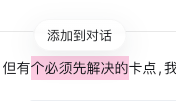
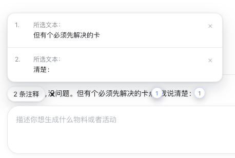
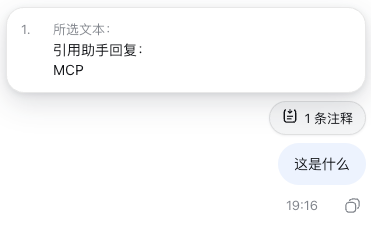

# DSH对话注释插件

在 DSH 的助手回复中选中文字后，点击 **添加到对话**。插件会把所选内容保留为独立注释，并在用户发送下一条消息时将其作为插件来源上下文提交。
插件实现极简对话注释效果，与codex类似。

English: [README.en.md](README.en.md)

## 效果

在助手回复中选中文字，点击浮动的 **添加到对话**。



可连续添加多条注释。输入框保持普通文本；悬浮“x 条注释”可查看每段原文，并逐条删除。



继续正常输入并发送。注释会随本次提交作为独立上下文传给模型；提交成功后自动清空，提交失败则恢复。



## 功能说明

- 纯浏览器端 DSH 客户端插件；不需要 Host 服务或任何产品专用集成。
- 每次选区限于同一条助手回复，可连续添加多条注释。
- 不自动发送；用户可继续编辑普通草稿，或只发送注释。
- “x 条注释”悬浮卡片展示完整原文，支持逐条删除及全部删除。
- 不向 Lexical 编辑器写入 Markdown、隐藏节点或 Chip，因此不会因 Backspace 误删。
- 注释待发送时，原助手选区附近保留一个小标记。
- 界面文案跟随 DSH 当前语言，支持中文和英文，并在切换语言后立即刷新。

## 兼容性

插件只依赖三个语义扩展点：助手正文的 `data-dsh-message-role="assistant"` 标记、`conversation.draftContexts` 提交服务及 DSH locale 服务。它不依赖页面 CSS class，也不要求 Host 服务或产品专用代码。

## 安装

```sh
dsh plugin --profile web add github:choco9527/dsh-add-to-chat
```

DSH Desktop 请安装到当前使用的 Desktop Profile；Electron 渲染器复用同一套 DSH Web 客户端模块图。

## 开发

```sh
corepack pnpm install
corepack pnpm run check
dsh plugin --profile web add .
```

安装后重启目标 DSH Profile。不要再手动把同一插件 id 写入 Profile 的 `cordis.patch.yml`，bundle 已自行注册。

## 许可证

MIT
