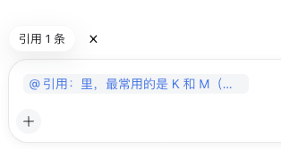

# dsh-add-to-chat

在 DSH 的助手回复中选中文字后，点击 **添加到对话**。插件会在当前输入框加入结构化引用注释，并只在用户发送下一条消息时将其展开为所选助手原文。

English: [README.en.md](README.en.md)

## 演示

选择助手回复中的文本后，可从浮动操作中将它加入当前对话。


输入框会显示可移除的引用注释，而不会把引用原文直接写入草稿。



## 功能说明

- 纯浏览器端 DSH 客户端插件；不需要 Host 服务或任何产品专用集成。
- 只处理单条助手回复中的一段选中文本。
- 不自动发送；用户仍可修改输入框后再发送。
- 输入框显示可删除的引用数量，并可悬浮预览；不会把 Markdown 直接写入用户草稿。
- 引用仍在输入框时，原助手选区附近保留一个小标记。
- 通过助手正文的 `data-dsh-message-role="assistant"` 标记判断选区归属，不依赖容易变化的 CSS 类名；宿主需要提供该语义标记、结构化引用插入与序列化能力，以及 `SessionInput.removeReference()`。

## 安装

```sh
dsh plugin --profile web add dsh-add-to-chat
```

DSH Desktop 请安装到当前使用的 Desktop Profile；Electron 渲染器复用同一套 DSH Web 客户端模块图。

## 开发

```sh
corepack pnpm install
corepack pnpm run check
dsh plugin --profile web add .
```

安装后重启目标 DSH Profile。不要再手动把同一插件 id 写入 Profile 的 `cordis.patch.yml`，bundle 已自行注册。

## 许可证

MIT
